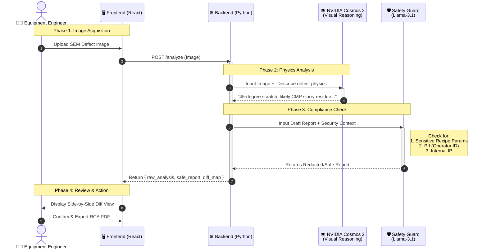
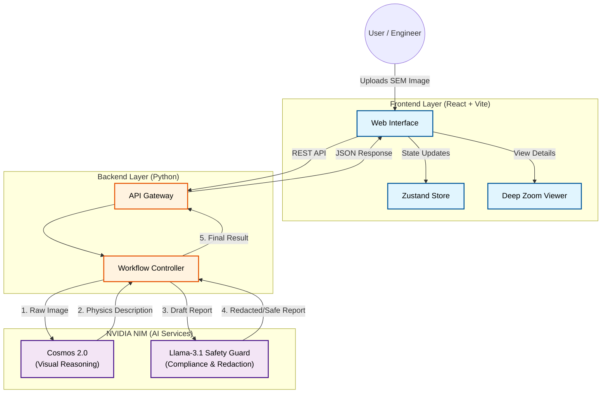

# 🔬 Visual Defect Analysis Agent (VDA-Agent)

[](https://build.nvidia.com)
[](https://reactjs.org/)
[](https://www.typescriptlang.org/)
[](https://vitejs.dev/)
[](https://fastapi.tiangolo.com/)
[](https://www.python.org/)
[](https://github.com/Giga-Lu/agentic-defect-analyst)

A production-grade **Full-Stack AI Agent** designed for semiconductor manufacturing inspection. This system demonstrates the integration of **Visual Language Models (VLMs)** for defect reasoning and **LLM Safety Guardrails** for secure, role-based data redaction.


---

## 🏗️ Use Case & Scenario

In a modern semiconductor Fab, data security is as critical as yield. This project simulates a real-world scenario where high-resolution **SEM (Scanning Electron Microscope)** defect images are analyzed by AI, but the sensitive process parameters must be protected based on the user's role.

### Role Definitions

| Role | Access Level | Data Display | Use Case |
| :--- | :--- | :--- | :--- |
| **Equipment Eng** | **Full (Normal)** | Raw RCA Reports | Inspecting specific machine values to perform maintenance. |
| **Yield Eng** | **Restricted** | **AI-Redacted** | Analyzing factory-wide trends without exposure to IP-sensitive recipes. |

### The Problem
*   **Equipment Engineers** need absolute details to fix machines.
*   **Yield Engineers** need to see trends but should not access "Secret Sauce" recipe parameters (IP Protection).

### The Solution: Agentic Redaction
Instead of static masks, this system uses **NVIDIA Llama 3 (70B/405B)** via NIM to intelligently identify and redact PII/IP data within Root Cause Analysis (RCA) reports dynamically.


--- 

## System Architecture 

This diagram illustrates how the front-end interacts with NVIDIA's two key AI models (Cosmos 2 & Safety Guard) through the Python Backend.




---

## 🛠️ Tech Stack

### Frontend (User Interface)
*   **React 18 + TypeScript**: Type-safe component architecture.
*   **Vite**: Ultra-fast build tool and dev server.
*   **Ant Design (AntD)**: Enterprise-standard UI framework.
*   **React-Zoom-Pan-Pinch**: High-performance Deep Zoom engine for SEM imagery.
*   **Zustand**: Lightweight state management for RBAC (Role-Based Access Control).

### Backend (AI Middleware)
*   **FastAPI (Python)**: High-performance asynchronous API server.
*   **NVIDIA NIM Integration**:
    *   **Vision-Language Model**: Simulates/Connects to **Cosmos 2** for visual reasoning.
    *   **Security Guardrail**: Real-time redaction using **Llama-3.1-70b-instruct**.
*   **Httpx**: Asynchronous HTTP client for low-latency AI inference calls.

### Image Synthesis
*   **Advanced SVG Generators**: Custom-built engine to simulate SEM characteristics (Electron charging effects, fractal grain noise, and technical metadata bars).

---

## **⚠️ Enterprise Security Note**:

While this demo utilizes NVIDIA's Cloud API for ease of demonstration, a production deployment for semiconductor foundries would utilize **Self-Hosted NIM Containers**.
In the production architecture:
 * The **Safety Guard model** is deployed on-premise (e.g., on an NVIDIA IGX edge device).
 * **Zero Data Exfiltration**: Sensitive SEM images and telemetry data never leave the factory's air-gapped network. The AI inference happens entirely locally.


---

## 🚀 Getting Started

### 1. Prerequisites
*   Node.js (v18+)
*   Python (3.11+)
*   NVIDIA NIM API Key ([Get one here](https://build.nvidia.com))

### 2. Backend Setup
```bash
# Navigate to project root
cd agentic-defect-analyst

# Install dependencies
pip install fastapi uvicorn httpx python-dotenv

# Run the server
python backend/main.py
```
*Note: The server defaults to port 8000.*

### 3. Frontend Setup
```bash
# In a new terminal
npm install
npm run dev
```
*Open `http://localhost:5173` to view the agent.*

---

## 📸 Key Features & Screenshots

*   **SEM Deep Zoom**: Inspect at the nanometer scale with simulated electron-beam artifacts.
*   **Live AI Redaction**: Watch the report transform in real-time when switching roles, powered by Llama 3.
*   **Synthetic Data Engine**: Realistic wafer defect generation for zero-dependency testing.

---

## 📂 Project Structure

```text
agentic_defect_analyst/
├── backend/                  # Python Backend (AI Orchestrator)
│   ├── main.py               # FastAPI entry point & NVIDIA NIM integration logic
│   └── __pycache__/          # Python bytecode cache
├── src/                      # React Frontend Source Code
│   ├── assets/               # Static assets (images, svg)
│   ├── components/           # Reusable UI Components
│   │   ├── DeepZoomViewer.tsx    # High-res SEM image viewer (OpenSeadragon wrapper)
│   │   ├── MainLayout.tsx        # App shell layout (Sidebar + Header)
│   │   ├── SafetyGuardDiff.tsx   # Side-by-side comparison of Redacted vs. Raw reports
│   │   └── SimpleDiffViewer.tsx  # Utility for text diff visualization
│   ├── data/                 # Mock data for offline demo mode
│   │   └── mockData.ts       # Simulated AI responses & defect telemetry
│   ├── store/                # State Management
│   │   └── useAppStore.ts    # Global state (Zustand) for User Role & Analysis Results
│   ├── types/                # TypeScript Type Definitions
│   │   └── index.ts          # Shared interfaces (AnalysisResult, DefectImage)
│   ├── utils/                # Helper Functions
│   │   └── imageGenerator.ts # Generates dummy SEM images for demo purposes
│   ├── App.tsx               # Main Application Component
│   ├── main.tsx              # React Entry Point
│   └── index.css             # Global Styles (Tailwind directives if used)
├── public/                   # Public static files
├── package.json              # Frontend dependencies & scripts
├── tsconfig.json             # TypeScript configuration
├── vite.config.ts            # Vite build & proxy configuration
└── README.md                 # Project documentation
```
